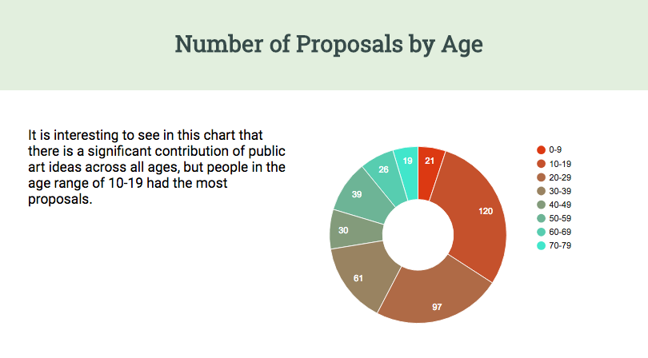
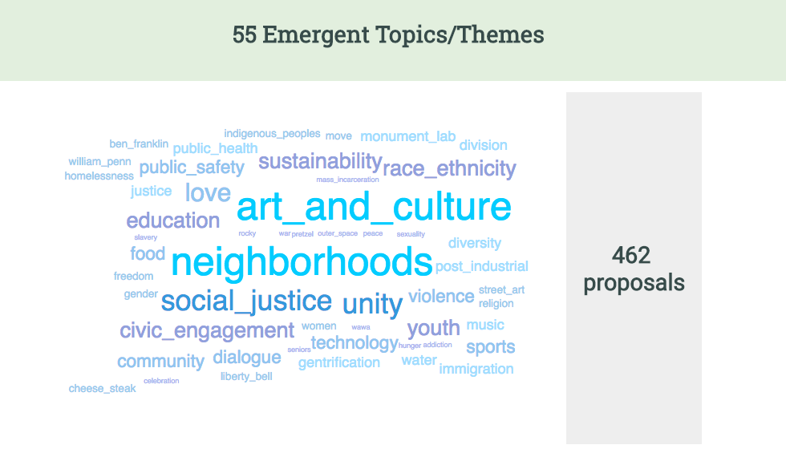

# Philadelphia Public Art Proposals: 
## A Mini Data Visualization Project

In the year 2015, the Monument Lab and the Haverford Digital Scholarship program collected 400+ public art proposals from Philadelphians, and made this data public through [Open Data Philly](https://www.opendataphilly.org/). I created this mini data visualization project to show how I used this open data to better understand the people involved in this project and the proposals they made. 

In this tutorial I will go over how I parsed the data in order to integrate it with two data visualization libraries, Google Charts and jqCloud2. 

## Technologies Used
* JavaScript
* jQuery
* [Google Charts](https://developers.google.com/chart/)
* [jqCloud2](https://www.npmjs.com/package/jqcloud2) (I used jqCloud2 instead of [jqCloud](http://mistic100.github.io/jQCloud/) for its autoresize feature) 

## Step-by-Step Guideline
#### 1. Understanding the monument lab geojson file
* The geojson file contains a list of feature objects.**Think of each feature as a proposal**. Each feature has two attributes:
    * Geometry: an object that describes the point coordinate (lat, long) of where the proposed art should be.
    * Properties: an object that includes the name, title, and topics of the proposal as attributes
    * Below is a subset of the geojson file:
    
    ```
    {
    "type": "FeatureCollection", 
    "features": [
    	{"type":"Feature",
	    "geometry":{"type":"Point","coordinates":[-75.246,39.955]},
	    "properties":{
	    	"age":20,
			"topic_violence":1,
			"topic_unity":null,
			"topic_technology":null,...}
	     },  
	     {"type":"Feature",
	     "geometry":{"type":"Point","coordinates":[-75.160,39.947]},
	     "properties":{
	     	"age":14, 			
	     	"topic_violence":1,
			"topic_unity":null,
			"topic_technology":1,...}
		  } ...
     	]
     }
    ```
  * From the sample, we can see that properties object has an **age attribute** that represents the age of the person who made the proposal.
   * We can also see that the properties object has different **topics as attributes** where the value is 1 if that topic is relevant to the proposal and “null” if not.     

#### 2. Setting up callback functions for drawing the charts
* For drawing the charts, we want to make sure we first load the needed library, load the geojson file, then draw the charts. We will use callback functions to ensure this order. 
* Setting a callback to run when the Google Visualization API is loaded:

```javascript
google.charts.setOnLoadCallback(drawCharts);
```
* The function drawCharts calls loadGeoJson and passes in drawAgeChart and drawTopicCloud functions as callback function arguments:

```javascript
function drawCharts() {
  loadGeoJson(drawAgeChart, drawTopicCloud);
}
```
#### 3. Creating a pie chart using Google Charts
* Understanding the data table needed for Google Charts
  * To create a Google Chart, we first need to create a **DataTable** then add appropriate columns. For this chart, we want two columns:
     * **Age Range** : this column will store the age range label as a _string_. ex. "0-9", "10-19", etc
     * **Count** : this column will store the _number_ of people in a specific age range who made a proposal.

  
 ```javascript
  // Create the data table.
  var ageDataTable = new google.visualization.DataTable();
  ageDataTable.addColumn('string', 'Age Range');
  ageDataTable.addColumn('number', 'Number of Participants');
 ``` 
* Dividing ages by ranges and creating labels
* Creating a list of tuples that contain the age range and the number of people who made a proposal within that age range 
* Customizing the Google Pie Chart
    * I first created a color gradient using [http://www.perbang.dk/rgbgradient/](http://www.perbang.dk/rgbgradient/)
    * Then added it in the option's 'colors' attribute
    
    ```
    var options = {
    	'colors': ['#DC3912','#C5512C','#AF6A46','#998361',
                 '#839B7B','#6DB496','#57CDB0','#41E6CB'],
       	'width': chartWidth * 0.7,
       	'height': 400,
       	'legend': 'right',
       	'pieHole': 0.4,
       	'pieSliceText': 'value',
       	'chartArea': {'width': '100%'}
     };
    ```


#### 4. Creating a wordcloud using jqCloud2
A word cloud is a weighted list of words where the size of the words represent its importance.

For this project, I chose a word cloud over a pie chart or a bar graph because we have a lot of topics (55) to fit in either an axis or as a slice of a pie. 

* Undertanding the data needed for jqCloud
	* to create a jqCloud wordcloud, we need to format our data as a list of objects which has the attributes **text** and **weight** 
		* Example:
		
		```
		 var word = {
			"text": topic,
      		"weight": count
      	 }
		```
	
